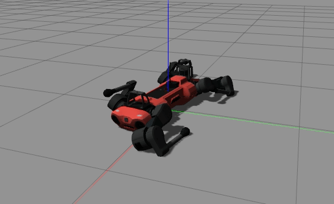

# Reinforcement Learning Experiments on Champ quadrupeds

This meta package currently contains ROS packages used to bring up a modified version of the champ quadruped simulation.

The main difference from the champ repositories is the focus on using effort commands instead of position commands. Additionally this repo focuses on the anymal_c robot as the target.



## Prerequisites

 - ROS Noetic recommended


## Setup
```shell
$ mkdir ~/<your_ws>
$ cd ~/<your_ws>
$ git clone https://github.com/dean4ta/champ_rl_experiments src
$ cd ~/<your_ws>/src
$ wstool update
$ cd ~/<your_ws>/src/robots
$ ./install_descriptions
$ cd ~/<your_ws>
$ rosdep install --from-paths src --ignore-src -r -y
$ catkin_make
```

## Quick Start

Terminal 1 - Launch the simulation
```shell
$ roslaunch anymal_c_config gazebo.launch
$ roslaunch anymal_c_config gazebo.launch champ_control:=true # launch with default champ control
```

Terminal 2 - Train 
```shell
$ roslaunch inverted_pendulum_rl_control train.launch
```

## Saving and Loading Model
See [Saving and Loading Model](https://github.com/dean4ta/rl_effort_control_ros#saving-and-loading-model) in the rl_effort_control_ros repo for details on saving and loading models.

## ROS Packages
see [`.rosinstall`](.rosinstall) for packages included in this meta package.
